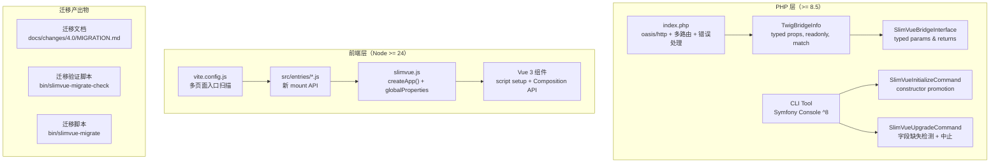

# Design Document

全栈 breaking 升级（v4.0）的技术设计，覆盖 PHP 端、前端、CLI 工具、迁移产出物四大领域。

---

## Overview

本设计基于 `requirements.md` 的 16 条 Requirement 和 Gatekeep Clarification Round 的 4 项决策（Q1–Q4），将升级工作分解为可执行的技术方案。

### 升级范围

| 领域 | 当前状态 | 目标状态 |
|------|----------|----------|
| PHP 运行时 | >= 7.0 | >= 8.5 |
| PHPUnit | ^9.0 | ^13.0 |
| Symfony Console / Filesystem | ^4.0 | 最新大版本（^8.0） |
| Twig | ^1.0 | 最新大版本 |
| Silex | ^2.2（已废弃） | `oasis/http` |
| Vue.js | ^2.6（已 EOL） | ^3（最新） |
| 构建工具 | Vue CLI 4 (webpack) | Vite（最新） |
| 测试框架（前端） | Jest ^26.6 | Vitest（最新） |
| ESLint | ^6.7 | 最新大版本（flat config） |
| Prettier | ^1.19 | 最新大版本 |
| Node.js | 未约束 | >= 24 |

### 执行策略

采用 red-green TDD 方式推进，PHP 端先行，前端跟进。每端 4 阶段：

```
阶段 1: 升级依赖（允许 red）
阶段 2: 升级测试（必须 green）
阶段 3: 升级语法（保持 green）
阶段 4: PBT + 覆盖率（保持 green，覆盖率 > 90%）
```

### 关键决策摘要

| 决策点 | 选择 | 来源 |
|--------|------|------|
| upgrade 命令缺少字段处理 | 检测到缺失时中止并报错 | Gatekeep Q1 |
| 迁移脚本代码转换策略 | AST 解析进行精确转换 | Gatekeep Q2 |
| PHP 命令执行方式 | 移除 `php74` alias，直接使用 `php` | Gatekeep Q3 |
| `index.php` 错误处理层级 | 同时演示应用层和框架级错误处理 | Gatekeep Q4 |

---

## Architecture

升级后的系统保持三层架构不变，但每层的技术栈全面更新：



### Bridge 数据流（升级后）

```
PHP (TwigBridgeInfo::render())
  → Twig (window.bridge = {{ bridge.render()|raw }})
  → JS (slimvue.bridge getter → window.bridge)
  → Vue 3 App (app.config.globalProperties.$bridge)
```

Bridge 机制的核心不变，变化点：
- PHP 端：`TwigBridgeInfo` 使用 typed properties、readonly、constructor promotion
- JS 端：`Vue.prototype` → `app.config.globalProperties`
- 挂载方式：`new Vue()` → `createApp().mount()`

---

## Components and Interfaces

### PHP 端组件

#### `SlimVueBridgeInterface`（升级后）

```php
namespace Oasis\SlimVue;

interface SlimVueBridgeInterface
{
    public function getExecTwig(string $pageTwig): string;
    public function add(string $key, mixed $value): void;
    public function render(): string;
}
```

变更点：所有参数和返回值添加类型声明。

#### `TwigBridgeInfo`（升级后）

```php
namespace Oasis\SlimVue;

class TwigBridgeInfo implements SlimVueBridgeInterface
{
    public function __construct(
        private array $data = [],
    ) {}

    public function add(string $key, mixed $value): void
    {
        $this->data[$key] = $this->getPlainValue($value);
    }

    public function getExecTwig(string $pageTwig): string
    {
        return preg_replace('#^slimvue/pages/#', 'slimvue/controllers/', $pageTwig);
    }

    public function render(): string
    {
        $result = json_encode($this->data);
        if ($result === false) {
            throw new \InvalidArgumentException(json_last_error_msg());
        }
        return $result;
    }

    private function getPlainValue(mixed $data): mixed
    {
        return match (true) {
            is_array($data) => array_map($this->getPlainValue(...), $data),
            $data instanceof \JsonSerializable => $data->jsonSerialize(),
            default => $data,
        };
    }
}
```

变更点：
- Constructor promotion（`private array $data`）
- Typed parameters 和 return types
- `match` 表达式替代 `if-else`
- 移除冗余 PHPDoc
- `array_map` + first-class callable 替代 `foreach`

注意：`getPlainValue` 中使用 `array_map` 时需要保留 key，实际实现应使用 `array_map` 配合 `array_keys` 或保持 `foreach` 以保留关联数组的 key。设计意图是展示 `match` 表达式的使用，具体实现在 task 阶段确定。

#### `SlimVueInitializeCommand`（升级后）

关键变更：
- Constructor promotion
- Typed properties（`$originalCwd`、`$fs` 等）
- 输出消息引用 Vite 命令（`npm run dev` 替代 `npm run serve`）
- `templateIterator()` 排除已移除的文件（`build/`、`vue.config.js`、`babel.config.js`、`jest.config.js`）
- PHP 8.5 语法：`readonly`、named arguments

#### `SlimVueUpgradeCommand`（升级后）

关键变更：
- **字段缺失检测**（Gatekeep Q1 决策）：当目标项目的 `package.json` 缺少 `name`、`version`、`dependencies` 或 `devDependencies` 字段时，中止并报错
- 升级过程中移除目标目录中的过时文件（`build/`、`vue.config.js`、`babel.config.js`、`jest.config.js`、`.eslintrc.js`）
- Constructor promotion、typed properties、return types

```php
// 字段缺失检测伪代码
$requiredFields = ['name', 'version', 'dependencies', 'devDependencies'];
foreach ($requiredFields as $field) {
    if (!array_key_exists($field, $packageJson)) {
        $output->writeln("<error>Missing required field '$field' in package.json. Please fix manually and retry.</error>");
        return Command::FAILURE;
    }
}
```

#### `index.php`（升级后 — Req 5）

使用 `oasis/http`（`Oasis\Mlib\Http\MicroKernel`）替代 Silex，增强为综合参考示例。

`oasis/http` 与 Silex 的核心差异：
- **路由**：不再使用闭包式 `$app->get('/', fn() => ...)`，改为 Symfony 风格的 Controller 类 + YAML 路由文件
- **Twig 集成**：不再通过 ServiceProvider 注册，改为 bootstrap config 的 `twig` 键
- **错误处理**：不再使用 `$app->error()` 方法，改为 bootstrap config 的 `error_handlers` 键（callable 对象）
- **依赖注入**：Controller 方法参数通过类型提示自动注入（`Request`、`MicroKernel`、自定义对象）

#### `index.php`（入口文件）

```php
<?php

use Oasis\Mlib\Http\MicroKernel;

require 'vendor/autoload.php';

$config = [
    'routing' => [
        'path'       => 'routes.yml',
        'namespaces' => ['Oasis\\SlimVue\\Demo\\'],
    ],
    'twig' => [
        'template_dir' => __DIR__ . '/templates',
    ],
    'error_handlers' => [
        new \Oasis\SlimVue\Demo\DemoErrorHandler(),
    ],
];

$kernel = new MicroKernel($config, isDebug: true);
$kernel->run();
```

#### `routes.yml`（路由配置）

```yaml
# 主页路由
home:
    path: /
    defaults:
        _controller: DemoController::homeAction

# 子页面路由
subpage:
    path: /subpage
    defaults:
        _controller: DemoController::subpageAction

# 应用层错误处理演示路由
error_demo:
    path: /error-demo
    defaults:
        _controller: DemoController::errorDemoAction
```

#### `DemoController`（路由控制器）

放置于项目根目录（仅作为演示，不属于 `src/` 库代码），通过 `routes.yml` 中的 `namespaces` 配置解析。

```php
<?php

namespace Oasis\SlimVue\Demo;

use Oasis\SlimVue\TwigBridgeInfo;
use Symfony\Component\HttpFoundation\Request;
use Symfony\Component\HttpFoundation\Response;
use Twig\Environment as TwigEnvironment;

class DemoController
{
    /**
     * 主页：演示多种 bridge 数据类型
     */
    public function homeAction(TwigEnvironment $twig): string
    {
        $bridge = new TwigBridgeInfo([
            'user'    => 'demo',                                    // string
            'count'   => 42,                                        // integer
            'ratio'   => 3.14,                                      // float
            'active'  => true,                                      // boolean
            'tags'    => ['vue', 'php'],                            // array
            'profile' => ['name' => 'SlimVue', 'meta' => ['v' => 4]], // nested object
        ]);

        // 演示 getExecTwig
        $controllerTwig = $bridge->getExecTwig('slimvue/pages/index.twig');

        return $twig->render('slimvue/pages/index.twig', [
            'title'  => 'SlimVue Demo',
            'bridge' => $bridge,
        ]);
    }

    /**
     * 子页面：演示第二个路由入口
     */
    public function subpageAction(TwigEnvironment $twig): string
    {
        $bridge = new TwigBridgeInfo([
            'page' => 'subpage',
        ]);

        return $twig->render('slimvue/pages/subpage.twig', [
            'title'  => 'SlimVue Subpage',
            'bridge' => $bridge,
        ]);
    }

    /**
     * 应用层错误处理演示（Gatekeep Q4）
     */
    public function errorDemoAction(TwigEnvironment $twig): Response
    {
        try {
            // 模拟业务逻辑异常
            throw new \RuntimeException('This is a demo application-level error');
        } catch (\RuntimeException $e) {
            return new Response(
                $twig->render('error.twig', [
                    'title'   => 'Application Error',
                    'message' => $e->getMessage(),
                ]),
                status: 500,
            );
        }
    }
}
```

#### `DemoErrorHandler`（框架级错误处理 — Gatekeep Q4）

```php
<?php

namespace Oasis\SlimVue\Demo;

use Symfony\Component\HttpFoundation\Response;

class DemoErrorHandler
{
    public function __invoke(\Exception $e, int $code): Response
    {
        $message = match ($code) {
            404     => 'Page not found',
            default => 'Internal server error: ' . $e->getMessage(),
        };

        return new Response(
            "<h1>Error {$code}</h1><p>{$message}</p>",
            $code,
        );
    }
}
```

注意事项：
- `DemoController` 和 `DemoErrorHandler` 仅作为演示代码，不属于 `src/` 库代码。可放在项目根目录的 `demo/` 目录下，或通过 `composer.json` 的 `autoload-dev` 配置加载
- `TwigEnvironment` 由 `oasis/http` 的依赖注入机制自动注入到 Controller 方法参数中（前提是 bootstrap config 中配置了 `twig` 键）
- Controller 方法返回 `string` 时，`oasis/http` 会通过 view handler 机制将其包装为 `Response` 对象；也可直接返回 `Response` 对象
- `routes.yml` 中的 `_controller` 值使用短类名（如 `DemoController::homeAction`），因为 `namespaces` 配置了 `Oasis\\SlimVue\\Demo\\` 前缀

### 前端组件

#### `slimvue.js`（升级后 — Vue 3）

```javascript
import { createApp } from 'vue';

export default {
    // 日志级别常量（不变）
    DEBUG_LOG_LEVEL: 0,
    DEFAULT_LOG_LEVEL: 10,
    INFO_LOG_LEVEL: 20,
    WARNING_LOG_LEVEL: 30,
    ERROR_LOG_LEVEL: 40,

    _logLevel: -1,

    set logLevel(val) { this._logLevel = val; },
    get logLevel() {
        if (this._logLevel === -1) {
            return this.isDebug ? this.DEBUG_LOG_LEVEL : this.INFO_LOG_LEVEL;
        }
        return this._logLevel;
    },

    get isDebug() {
        return import.meta.env.MODE !== 'production';
    },

    get bridge() {
        if (typeof window.bridge === 'undefined') {
            return JSON.parse(import.meta.env.VITE_BRIDGE);
        }
        return window.bridge;
    },

    mount(vueComponent) {
        this.log('Will start to mount component to slimvue app', vueComponent);
        const app = createApp(vueComponent);
        // 注入全局属性（替代 Vue.prototype）
        app.config.globalProperties.$toCssUrl = (imageUrl) => `url(${imageUrl})`;
        app.config.globalProperties.$toCssBackgroundImage = (imageUrl) => ({
            backgroundImage: `url(${imageUrl})`,
        });
        app.mount('#app');
        window.slimvue = app;
        return app;
    },

    // 日志方法（不变）
    log(...args) { if (this.logLevel <= this.DEFAULT_LOG_LEVEL) console.log(...args); },
    debug(...args) { if (this.logLevel <= this.DEBUG_LOG_LEVEL) console.debug(...args); },
    info(...args) { if (this.logLevel <= this.INFO_LOG_LEVEL) console.info(...args); },
    warn(...args) { if (this.logLevel <= this.WARNING_LOG_LEVEL) console.warn(...args); },
    error(...args) { if (this.logLevel <= this.ERROR_LOG_LEVEL) console.error(...args); },
};
```

变更点：
- `import Vue from 'vue'` → `import { createApp } from 'vue'`
- `new Vue({ render: h => h(component) }).$mount('#app')` → `createApp(component).mount('#app')`
- `Vue.prototype.$xxx` → `app.config.globalProperties.$xxx`（移入 `mount()` 内部）
- `Vue.config.productionTip` → 移除（Vue 3 无此配置）
- `process.env.NODE_ENV` → `import.meta.env.MODE`（Vite 环境变量）
- `process.env.VUE_APP_BRIDGE` → `import.meta.env.VITE_BRIDGE`（Vite 环境变量前缀）

#### Vue 3 模板组件设计

所有组件重新设计，使用 `<script setup>` + Composition API：

**App.vue** — 主页面组件，演示 `defineProps`、bridge 数据展示

```vue
<script setup>
import { computed } from 'vue';
import slimvue from 'slimvue';
import HelloWorld from './HelloWorld.vue';
import MyClock from './MyClock.vue';

const bridge = computed(() => slimvue.bridge);
</script>
```

**HelloWorld.vue** — 演示 `defineProps`、`defineEmits`

```vue
<script setup>
const props = defineProps({
    msg: { type: String, required: true },
});
const emit = defineEmits(['greet']);
</script>
```

**MyClock.vue** — 演示 `ref`、`computed`、`watch`、composables

```vue
<script setup>
import { useClock } from '../composables/useClock';
const { fullDateTime } = useClock();
</script>
```

**Composable: `useClock`** — 提取可复用逻辑

```javascript
// src/composables/useClock.js
import { ref, computed, onMounted, onUnmounted } from 'vue';

export function useClock() {
    const time = ref(Date.now());
    let timer = null;

    const fullDateTime = computed(() => {
        const d = new Date(time.value);
        // 格式化逻辑
        return formatDateTime(d);
    });

    onMounted(() => { timer = setInterval(() => { time.value = Date.now(); }, 1000); });
    onUnmounted(() => { clearInterval(timer); });

    return { time, fullDateTime };
}
```

**SubPage.vue** — 演示 `reactive`

```vue
<script setup>
import { reactive } from 'vue';
const state = reactive({ title: 'Subpage' });
</script>
```

### 构建系统（Vite）

#### `vite.config.js`

```javascript
import { defineConfig } from 'vite';
import vue from '@vitejs/plugin-vue';
import { resolve } from 'path';
import { scanEntries } from './build/entries.js';
import { checkNodeVersion } from './build/check-node.js';

// Node.js 版本检查
checkNodeVersion(24);

export default defineConfig(({ mode }) => {
    const entries = scanEntries();
    return {
        plugins: [vue()],
        resolve: {
            alias: {
                '@': resolve(__dirname, 'src'),
                'slimvue': resolve(__dirname, 'slimvue.js'),
                'assets': resolve(__dirname, 'src/assets'),
            },
        },
        build: {
            rollupOptions: {
                input: entries.inputMap,
            },
            outDir: process.env.OUTPUT_DIR || 'dist',
        },
        base: process.env.PUBLIC_PATH || '/',
    };
});
```

#### 多页面入口扫描器（`build/entries.js`）

从 CommonJS 迁移到 ESM，保持相同的扫描逻辑：

```javascript
// build/entries.js (ESM)
import fs from 'fs';
import path from 'path';
import { fileURLToPath } from 'url';

const __dirname = path.dirname(fileURLToPath(import.meta.url));

export function scanEntries(options = {}) {
    const {
        entryDir = path.resolve(__dirname, '../src/entries'),
        templateDir = path.resolve(__dirname, '../template'),
        buildFileType = process.env.BUILD_FILE_TYPE || 'twig',
        excludedEntries = (process.env.EXCLUED_ENTRIES || '').split(',').filter(Boolean),
    } = options;

    // 递归扫描 entryDir 下所有 .js 文件
    // 排除 excludedEntries 中的条目
    // 生成 inputMap 和 pageConfig
    // ...
}
```

入口扫描规则（与当前 webpack 构建一致）：
- 扫描 `src/entries/` 下所有 `.js` 文件（含子目录）
- 入口 key = 相对路径去掉 `.js` 后缀，`/` 替换为 `-`
- 输出文件名 = `pages/` + 相对路径，后缀替换为 `BUILD_FILE_TYPE`
- 模板文件 = `template/index.${BUILD_FILE_TYPE}`
- 通过 `EXCLUED_ENTRIES` 环境变量排除特定入口

#### Node.js 版本检查（`build/check-node.js`）

```javascript
// build/check-node.js
const minMajor = 24;
const current = parseInt(process.version.slice(1), 10);
if (current < minMajor) {
    console.error(
        `Error: Node.js >= ${minMajor} is required. Current version: ${process.version}`
    );
    process.exit(1);
}

// 同时导出函数供 vite.config.js 等模块内调用
export function checkNodeVersion(min) {
    const cur = parseInt(process.version.slice(1), 10);
    if (cur < min) {
        console.error(`Error: Node.js >= ${min} is required. Current version: ${process.version}`);
        process.exit(1);
    }
}
```

该文件同时支持两种使用方式：
- 作为独立脚本执行（`node build/check-node.js`）：顶层代码立即检查
- 作为模块导入（`import { checkNodeVersion } from './build/check-node.js'`）：在 `vite.config.js` 中调用

在 `package.json` 的 `build` 和 `release` scripts 中调用。

#### TDK 元数据注入

TDK（title, description, keywords）注入通过 Vite 的 `transformIndexHtml` 钩子实现：

```javascript
// vite 插件或 vite.config.js 内
function tdkPlugin(tdkMap) {
    return {
        name: 'slimvue-tdk',
        transformIndexHtml(html, ctx) {
            const entry = ctx.chunk?.name;
            const tdk = tdkMap[entry];
            if (!tdk) return html;
            return html
                .replace(/<title>.*?<\/title>/, `<title>${tdk.title}</title>`)
                .replace(/<!-- TDK_KEYWORDS -->/, `<meta name="keywords" content="${tdk.keywords}">`)
                .replace(/<!-- TDK_DESCRIPTION -->/, `<meta name="description" content="${tdk.description}">`);
        },
    };
}
```

### ESLint 与 Prettier 配置（Req 11）

#### `eslint.config.js`（flat config）

替换 `.eslintrc.js`，采用 ESLint flat config 格式：

```javascript
import pluginVue from 'eslint-plugin-vue';
import eslintConfigPrettier from 'eslint-config-prettier';

export default [
    ...pluginVue.configs['flat/recommended'],
    eslintConfigPrettier,
    {
        rules: {
            // 项目自定义规则
        },
    },
];
```

变更点：
- `.eslintrc.js`（CommonJS，extends 模式）→ `eslint.config.js`（ESM，flat config 数组模式）
- `eslint-plugin-vue` 使用 Vue 3 recommended config（`flat/recommended`）
- Prettier 集成通过 `eslint-config-prettier` 关闭冲突规则

#### `prettier.config.js`

保持独立配置文件，升级到 Prettier 最新大版本选项。当前配置内容在 task 阶段根据 Prettier 最新版本 API 确定。

### 覆盖率产物清理（Req 13 AC1–AC2）

- 在 `.gitignore` 中添加 `slimvue-template/coverage/`
- 执行 `git rm -r --cached slimvue-template/coverage/` 将已跟踪的覆盖率文件从版本控制中移除
- 此操作在 task 阶段的依赖升级阶段执行，作为仓库清理的一部分

### CLI 工具适配

#### `bin/slimvue`

```php
$app = new Application('slimvue', '4.0');
```

版本号已更新为 `4.0`（当前代码中已是 `4.0`）。

Symfony Console ^8 的 API 变更主要影响：
- `Command::execute()` 返回类型必须为 `int`（`Command::SUCCESS` / `Command::FAILURE`）
- 部分 deprecated 方法的替换（在 task 阶段根据实际 API 变更确定）

### 迁移产出物

#### 迁移文档（`docs/changes/4.0/MIGRATION.md`）

结构：
1. PHP Breaking Changes（PHP 版本、依赖替换、API 变更）
2. Frontend Breaking Changes（Vue 2→3、webpack→Vite、Jest→Vitest、ESLint flat config）
3. `slimvue.js` API Changes（`Vue.prototype` → `globalProperties`、`new Vue()` → `createApp()`）
4. CLI Command Changes（新模板结构、移除文件、更新输出消息）
5. Step-by-Step Migration Instructions

#### 迁移验证脚本（`bin/slimvue-migrate-check`）

独立 PHP 脚本，接受项目目录作为参数，执行以下检查：

| 检查项 | 检查内容 |
|--------|----------|
| PHP 版本约束 | `composer.json` 中 `require.php` >= 8.5 |
| 废弃依赖 | 无 `silex/silex`、`vue` ^2、Vue CLI 包、Jest 包、旧 ESLint 配置包 |
| PHP 废弃 API | 无 Silex 类引用、旧 Symfony Console API |
| JS/Vue 废弃 API | 无 `new Vue(`、`Vue.prototype`、`jest.fn()`、Options API 模式 |
| 已移除文件 | 无 `vue.config.js`、`babel.config.js`、`jest.config.js`、`build/` |

输出格式：每项检查显示 ✓/✗ 状态 + 修复建议。

#### 迁移脚本（`bin/slimvue-migrate`）

独立 PHP 脚本，接受项目目录作为参数，执行以下自动化步骤：

1. **备份**：对所有将修改的文件创建 `.bak` 备份
2. **composer.json 更新**：PHP 版本约束 → >= 8.5，替换废弃依赖
3. **移除过时文件**：`vue.config.js`、`babel.config.js`、`jest.config.js`、`.eslintrc.js`、`build/`
4. **JS 代码转换**（Gatekeep Q2 决策 — AST 解析）：
   - 使用 PHP 调用 Node.js AST 工具（如 `jscodeshift`）进行精确转换
   - `new Vue(` → `createApp(`
   - `Vue.prototype` → `app.config.globalProperties`
   - 仅替换实际代码中的调用，不影响注释和字符串
5. **package.json scripts 更新**：Vue CLI 命令 → Vite 命令
6. **输出变更日志**：列出所有已执行的变更和需要手动处理的项目

AST 转换方案：
- 迁移脚本本身是 PHP 脚本
- JS AST 转换通过 `exec()` 调用 Node.js 脚本（`jscodeshift` transform）
- transform 脚本随 SlimVue 包一起分发（`bin/transforms/vue2-to-vue3.js`）
- 如果目标环境没有 Node.js，回退到正则替换并在日志中警告

---

## Data Models

### PHP 端数据模型变更

#### `TwigBridgeInfo` 内部数据

无结构性变更。`$data` 仍为 `array`，存储键值对。变更仅在类型声明层面：

```php
// Before
private $data = [];
public function __construct($data = [])

// After
public function __construct(
    private array $data = [],
) {}
```

#### `SlimVueUpgradeCommand` — `package.json` 字段验证

新增字段缺失检测逻辑。当以下字段缺失时中止：

| 字段 | 缺失时行为 |
|------|-----------|
| `name` | 中止，报错 |
| `version` | 中止，报错 |
| `dependencies` | 中止，报错 |
| `devDependencies` | 中止，报错 |

### 前端数据模型变更

#### `slimvue.js` 导出对象

| 属性/方法 | 变更 |
|-----------|------|
| `bridge` getter | `process.env.VUE_APP_BRIDGE` → `import.meta.env.VITE_BRIDGE` |
| `isDebug` getter | `process.env.NODE_ENV` → `import.meta.env.MODE` |
| `mount()` | `new Vue()` → `createApp()`，全局属性注入移入此方法 |

#### 构建配置数据模型

| 配置项 | 当前（webpack） | 目标（Vite） |
|--------|----------------|-------------|
| 入口扫描 | `build/entries.js`（CommonJS） | `build/entries.js`（ESM） |
| 构建配置 | `build/config.js` | 内联到 `vite.config.js` |
| 开发服务器 | `build/devServer.js` | Vite 内置 dev server |
| TDK 注入 | `build/tdk.js` + HtmlWebpackPlugin | `build/tdk.js` + Vite `transformIndexHtml` 插件 |
| Webpack 修改 | `build/webpack-modify/` | 移除 |
| Webpack 插件 | `build/webpack-add/` | 移除 |

#### `package.json` scripts 变更

| Script | 当前 | 目标 |
|--------|------|------|
| `dev` | `vue-cli-service serve --mode serve` | `vite` |
| `build` | `vue-cli-service build --mode development` | `node build/check-node.js && vite build --mode development` |
| `release` | `vue-cli-service build --modern` | `node build/check-node.js && vite build` |
| `preview` | （无） | `vite preview` |
| `lint` | `vue-cli-service lint` | `eslint .` |
| `test` | `jest --no-cache` | `vitest run` |
| `test:watch` | （无） | `vitest` |
| `test:coverage` | `jest --no-cache --coverage` | `vitest run --coverage` |

注意：`watch` 和 `lib` scripts 在 Vite 中有不同的实现方式，将在 task 阶段确定。

### 迁移验证脚本数据模型

检查结果数据结构：

```php
[
    'checks' => [
        [
            'name'   => 'PHP version constraint',
            'status' => 'pass' | 'fail',
            'detail' => '...',
            'hint'   => '...',  // 仅 fail 时
        ],
        // ...
    ],
    'summary' => [
        'total'  => int,
        'passed' => int,
        'failed' => int,
    ],
]
```

---

## Impact Analysis

本次升级是全栈 breaking 变更，影响范围覆盖所有层。

### 受影响的 State 文档

| 文件 | 受影响 Section | 变更内容 |
|------|---------------|----------|
| `docs/state/architecture.md` | 技术选型表 | PHP >= 7.0 → >= 8.5，Symfony ^4 → ^8，Vue ^2.6 → ^3，Vue CLI 4 → Vite，Silex → `oasis/http` |
| `docs/state/architecture.md` | CLI 命令 — `upgrade` | 新增字段缺失检测行为 |
| `docs/state/architecture.md` | 多页面入口机制 | webpack → Vite，`vue.config.js` → `vite.config.js` |
| `docs/state/data-model.md` | 前端核心模块 | `bridge` getter 环境变量前缀变更，`mount()` API 变更 |
| `docs/state/data-model.md` | 构建配置 — 环境变量 | `VUE_APP_BRIDGE` → `VITE_BRIDGE`，新增 Node.js 版本检查 |
| `docs/state/data-model.md` | PHP 接口 | 所有方法添加类型声明 |
| `PROJECT.md` | 技术栈 | PHP 版本、依赖版本、前端框架版本全面更新 |
| `PROJECT.md` | 构建与运行命令 | `php74` → `php`，`npm run serve` → `npm run dev`，新增 Vitest 命令 |
| `PROJECT.md` | 运行入口 | `index.php` 从 Silex 改为 `oasis/http` |

### 现有行为变化

| 模块 | 变化 |
|------|------|
| `TwigBridgeInfo` | 接口签名添加类型声明（breaking：调用方如传入非预期类型将触发 TypeError） |
| `SlimVueBridgeInterface` | 方法签名添加参数和返回类型（breaking：实现类必须匹配） |
| `SlimVueUpgradeCommand` | 新增字段缺失检测——缺少 `name`/`version`/`dependencies`/`devDependencies` 时中止（新行为） |
| `SlimVueInitializeCommand` | 输出消息变更（`npm run serve` → `npm run dev`），模板排除列表变更 |
| `slimvue.js` | `mount()` 返回 Vue 3 App 实例（非 Vue 2 实例），全局属性注入方式变更 |
| `index.php` | 框架从 Silex 替换为 `oasis/http`（`MicroKernel` + Controller 类 + YAML 路由），新增多路由和错误处理演示 |

### 数据模型变更

- `TwigBridgeInfo::$data` 内部结构不变，仅类型声明层面变更（`private $data` → `private array $data`）
- `slimvue.js` 导出对象结构不变，`mount()` 返回类型从 Vue 2 实例变为 Vue 3 App 实例
- 无持久化数据模型变更，不涉及旧数据兼容问题

### 配置项变更

| 配置项 | 变更 |
|--------|------|
| `composer.json` `require.php` | `>=7.0` → `>=8.5` |
| `composer.json` `require-dev` | 移除 `silex/silex`，新增 `oasis/http`、`eris` |
| `package.json` `engines.node` | 新增 `>=24` |
| `package.json` `devDependencies` | 移除 Vue CLI / Babel / Jest 系列，新增 Vite / Vitest / fast-check |
| `package.json` `scripts` | 全部从 Vue CLI 命令更新为 Vite 命令 |
| `.eslintrc.js` | 移除，替换为 `eslint.config.js`（flat config） |
| `.gitignore` | 新增 `slimvue-template/coverage/` |
| 环境变量前缀 | `VUE_APP_*` → `VITE_*` |

### 外部系统交互

- `oasis/http` 替代 Silex：`index.php` 的路由注册和中间件 API 完全变更，但 `index.php` 仅为演示文件，不影响库的核心功能
- `jscodeshift`（迁移脚本 AST 转换）：新增对 Node.js 运行时的依赖，如目标环境无 Node.js 则回退到正则替换

### Graphify 辅助分析

基于 graphify GRAPH_REPORT.md 的 community 结构和 god nodes：

- **God node `TwigBridgeInfo`（6 edges）**：连接 Bridge & Manual、TwigBridgeInfo Implementation 两个 community。类型声明变更影响所有实现类和调用方。当前仅有一个实现类，影响可控。
- **God node `Frontend Layer (Vue 2 MPA)`（5 edges）**：跨 Frontend Build & Template、Core Architecture & SSOT、Bridge & Manual 三个 community。Vue 2 → Vue 3 迁移影响所有前端组件、构建配置和 bridge 集成。
- **God node `SlimVueUpgradeCommand`（4 edges）**：Upgrade Command community 的核心。新增字段缺失检测是行为变更，影响所有使用 `upgrade` 命令的下游用户。
- **Hyperedge `Bridge Data Flow`**：`SlimVueBridgeInterface` → `TwigBridgeInfo` → `slimvue.js` 的数据流路径。PHP 端类型声明变更和 JS 端 API 变更需要同步，但 bridge 的 JSON 序列化格式不变，数据兼容性无风险。

---

## Correctness Properties

*A property is a characteristic or behavior that should hold true across all valid executions of a system — essentially, a formal statement about what the system should do. Properties serve as the bridge between human-readable specifications and machine-verifiable correctness guarantees.*


### PHP 端属性

#### Property 1: TwigBridgeInfo render round-trip

*For any* valid bridge data（包含 string、int、float、bool、null、array、nested array 的任意组合），构造 `TwigBridgeInfo($data)` 后调用 `json_decode(render(), true)` 应产生与原始输入数据等价的值。

**Validates: Requirements 4.1**

#### Property 2: TwigBridgeInfo::add() idempotence

*For any* key-value pair `(k, v)`（其中 `v` 为 JSON-serializable 值），对同一个 `TwigBridgeInfo` 实例执行 `add(k, v)` 两次后的 `render()` 输出，应与仅执行一次 `add(k, v)` 的 `render()` 输出相同。

**Validates: Requirements 4.2**

#### Property 3: TwigBridgeInfo::getExecTwig() metamorphic length

*For any* 字符串 `$path`，`getExecTwig($path)` 的输出长度与输入长度之差应满足：当 `$path` 以 `"slimvue/pages/"` 开头时差值为 6（`strlen("controllers") - strlen("pages")`），否则差值为 0。

**Validates: Requirements 4.3**

#### Property 4: Initialize command name+version invariant

*For any* 合法项目名称（匹配 `/^[a-z_][a-z0-9_-]*$/`），执行 `initialize` 命令后生成的 `package.json` 应始终包含该项目名称作为 `name` 字段值，且 `version` 字段值为 `"0.1.0"`。

**Validates: Requirements 4.4**

#### Property 5: Upgrade command name+version preservation

*For any* 已存在的项目（`package.json` 包含 `name`、`version`、`dependencies`、`devDependencies` 四个字段），执行 `upgrade` 命令后，`package.json` 中的 `name` 和 `version` 应与升级前完全一致。

**Validates: Requirements 4.5**

#### Property 6: Initialize command excludes obsolete files

*For any* 合法项目名称，执行 `initialize` 命令后生成的项目目录不应包含已移除的文件（`build/`、`vue.config.js`、`babel.config.js`、`jest.config.js`）。

**Validates: Requirements 12.2**

#### Property 7: Upgrade command removes obsolete files

*For any* 已存在的项目（包含过时文件 `build/`、`vue.config.js`、`babel.config.js`、`jest.config.js`、`.eslintrc.js`），执行 `upgrade` 命令后，这些过时文件应被移除。

**Validates: Requirements 12.4**

### 前端属性

#### Property 8: slimvue.js bridge getter round-trip

*For any* 合法的 JSON-serializable 对象，将其赋值给 `window.bridge` 后，通过 `slimvue.bridge` getter 读取应返回等价的对象。

**Validates: Requirements 10.1**

#### Property 9: slimvue.js logLevel setter/getter round-trip

*For any* 有效的日志级别数值（非负整数），通过 `logLevel` setter 设置后，`logLevel` getter 应返回相同的值。

**Validates: Requirements 10.2**

#### Property 10: Entry scanner correctness

*For any* `src/entries/` 目录下的 `.js` 文件集合和任意排除列表，入口扫描器应：(a) 为每个未被排除的 `.js` 文件生成恰好一个页面配置；(b) 不为被排除的文件生成页面配置；(c) 输出路径遵循命名约定（`pages/` + 相对路径，后缀替换为 `BUILD_FILE_TYPE`）。

**Validates: Requirements 7.2, 7.6, 7.7**

#### Property 11: Entry scanner metamorphic — add entry increases page count

*For any* 已有的入口文件集合，向 `src/entries/` 添加一个新的 `.js` 文件后，扫描器生成的页面数量应恰好增加 1。

**Validates: Requirements 10.3**

#### Property 12: TDK metadata injection invariant

*For any* 合法的 TDK 对象（包含 `title`、`keywords`、`description` 字符串），经过 TDK 注入后的 HTML 应包含指定的 title、keywords 和 description。

**Validates: Requirements 7.8, 10.4**

### 迁移工具属性

#### Property 13: Migration validator — dependency/version validation

*For any* `composer.json`（包含任意 PHP 版本约束和任意依赖集合），迁移验证脚本应正确识别：(a) PHP 版本约束是否满足 >= 8.5；(b) 是否存在废弃依赖引用（`silex/silex`、Vue 2 相关包等）。

**Validates: Requirements 15.1, 15.2**

#### Property 14: Migration validator — deprecated pattern detection

*For any* PHP/JS/Vue 源文件内容，迁移验证脚本应正确检测废弃 API 使用模式（Silex 类引用、`new Vue(`、`Vue.prototype`、`jest.fn()` 等），且不产生误报（不匹配注释和字符串中的模式）。

**Validates: Requirements 15.3, 15.4**

#### Property 15: Migration validator — removed files detection

*For any* 项目目录（包含任意文件集合），迁移验证脚本应正确识别哪些应被移除的文件仍然存在（`vue.config.js`、`babel.config.js`、`jest.config.js`、`build/`）。

**Validates: Requirements 15.5**

#### Property 16: Migration script — config file migration

*For any* `composer.json`（包含任意 PHP 版本约束和任意废弃依赖）和 `package.json`（包含任意 Vue CLI scripts），迁移脚本应：(a) 将 PHP 版本约束更新为 >= 8.5；(b) 替换废弃依赖为新等价物；(c) 将 Vue CLI 命令更新为 Vite 命令。

**Validates: Requirements 16.1, 16.2, 16.5**

#### Property 17: Migration script — obsolete file removal

*For any* 项目目录（包含任意过时文件子集），迁移脚本应移除所有指定的过时文件（`vue.config.js`、`babel.config.js`、`jest.config.js`、`.eslintrc.js`、`build/`），且不影响其他文件。

**Validates: Requirements 16.3**

#### Property 18: Migration script — AST-based JS code transformation

*For any* 包含 Vue 2 API 调用的 JS 文件（`new Vue(`、`Vue.prototype`），迁移脚本的 AST 转换应：(a) 正确替换实际代码中的调用为 Vue 3 等价物；(b) 不修改注释和字符串中的匹配文本；(c) 保持代码的语法正确性。

**Validates: Requirements 16.4**

#### Property 19: Migration script — backup creation

*For any* 将被修改的文件集合，迁移脚本在修改前应为每个文件创建 `.bak` 备份，且备份内容与原文件完全一致。

**Validates: Requirements 16.6**

---

## Error Handling

### PHP 端

| 场景 | 处理方式 |
|------|----------|
| `TwigBridgeInfo::render()` JSON 编码失败 | 抛出 `InvalidArgumentException`（现有行为，保持不变） |
| `SlimVueUpgradeCommand` — `package.json` 缺少必需字段 | 输出错误消息，返回 `Command::FAILURE`（Gatekeep Q1 决策） |
| `SlimVueUpgradeCommand` — `package.json` 不存在 | 抛出异常（`file_get_contents` 失败） |
| `SlimVueInitializeCommand` — 无效项目名称 | 交互式提示用户重新输入（现有行为，保持不变） |
| `index.php` — 路由 404 | 框架级 `error_handlers`（`DemoErrorHandler`）返回 404 错误页面 |
| `index.php` — 未捕获异常 | 框架级 `error_handlers`（`DemoErrorHandler`）返回 500 错误页面 |
| `index.php` — 应用层异常 | `DemoController::errorDemoAction()` 中 `try-catch` 捕获并返回友好错误响应 |

### 前端

| 场景 | 处理方式 |
|------|----------|
| `slimvue.bridge` — `window.bridge` 未定义且 `VITE_BRIDGE` 未设置 | `JSON.parse(undefined)` 抛出异常（与当前行为一致） |
| Node.js 版本不满足 >= 24 | `checkNodeVersion()` 输出错误消息并 `process.exit(1)` |
| 入口扫描器 — `src/entries/` 目录不存在 | 返回空页面配置（不报错） |

### 迁移工具

| 场景 | 处理方式 |
|------|----------|
| 迁移验证脚本 — 目标目录不存在 | 输出错误消息并退出 |
| 迁移脚本 — 备份创建失败（磁盘空间不足等） | 中止迁移，输出错误消息 |
| 迁移脚本 — AST 转换失败（Node.js 不可用） | 回退到正则替换，在日志中警告用户手动检查 |
| 迁移脚本 — 目标文件不存在（如无 `vue.config.js`） | 跳过该步骤，在日志中记录 |

---

## Testing Strategy

### 双轨测试方法

| 测试类型 | 工具 | 用途 |
|----------|------|------|
| Unit Tests（PHP） | PHPUnit ^13 | 具体示例、边界条件、错误路径 |
| Property Tests（PHP） | eris ~1.1 | 通用属性验证（Property 1–7） |
| Unit Tests（前端） | Vitest | 具体示例、组件行为、边界条件 |
| Property Tests（前端） | fast-check + Vitest | 通用属性验证（Property 8–12） |
| Unit Tests（迁移工具） | PHPUnit ^13 + Vitest | 具体转换示例 |
| Property Tests（迁移工具） | eris + fast-check | 通用属性验证（Property 13–19） |
| Integration Tests | PHPUnit + Vitest | CLI 命令端到端、构建产物验证 |

### PBT 配置

- **PHP 端（eris ~1.1）**：每个 property test 最少 100 次迭代
- **前端（fast-check）**：每个 property test 最少 100 次迭代（`fc.assert(fc.property(...), { numRuns: 100 })`）
- 每个 property test 必须通过注释引用设计文档中的 property 编号
- 标签格式：`Feature: release-4.0, Property {number}: {property_text}`

### PHP 端测试计划

| 测试文件 | 覆盖内容 |
|----------|----------|
| `tests/TwigBridgeInfoTest.php` | 现有 UT（适配 PHPUnit 13）+ PBT（Property 1–3） |
| `tests/SlimVueInitializeCommandTest.php` | 现有 UT（适配 PHPUnit 13）+ PBT（Property 4, 6） |
| `tests/SlimVueUpgradeCommandTest.php` | 现有 UT（适配 PHPUnit 13）+ PBT（Property 5, 7）+ 字段缺失中止测试 |
| `tests/MigrationValidatorTest.php` | UT + PBT（Property 13–15） |
| `tests/MigrationScriptTest.php` | UT + PBT（Property 16–17, 19） |

### 前端测试计划

| 测试文件 | 覆盖内容 |
|----------|----------|
| `tests/slimvue.test.js` | 现有 UT（迁移到 Vitest）+ PBT（Property 8–9） |
| `tests/build-entries.test.js` | 现有 UT（迁移到 Vitest）+ PBT（Property 10–11） |
| `tests/build-tdk.test.js` | 现有 UT（迁移到 Vitest）+ PBT（Property 12） |
| `tests/build-config.test.js` | 现有 UT（迁移到 Vitest） |
| `tests/components.test.js` | 现有 UT（迁移到 Vitest，适配 Vue 3 test-utils ^2） |
| `tests/migration-transform.test.js` | PBT（Property 18）— AST 转换测试 |

### 迁移工具测试（PHP 端）

迁移验证脚本和迁移脚本的 PBT 测试使用 eris 生成随机的 `composer.json`、`package.json` 和源文件内容，验证 Property 13–19。

### 覆盖率目标

| 领域 | 目标 | 验证命令 |
|------|------|----------|
| PHP `src/` | > 90% | `php vendor/bin/phpunit --coverage-text` |
| 前端 `slimvue.js` + `build/` + `src/components/` | > 90% | `npx vitest run --coverage` |

### TDD 节奏与阶段验证

| 阶段 | 结束状态 | 验证方式 |
|------|----------|----------|
| 阶段 1（升级依赖） | 允许 red | `composer install` / `npm install` 成功 |
| 阶段 2（升级测试） | 必须 green | `php vendor/bin/phpunit` / `npx vitest run` 全部通过 |
| 阶段 3（升级语法） | 保持 green | 同上 |
| 阶段 4（PBT + 覆盖率） | green + > 90% | 同上 + `--coverage` |

---

## Socratic Review Log

### Round 1 — Self Review

**Q1: 设计是否覆盖了 requirements.md 中的所有 16 条 Requirement？**

逐条检查：
- Req 1（PHP 依赖升级）→ Architecture 表格 + Components/Interfaces 中的类型声明变更 ✓
- Req 2（PHP 源码现代化）→ Components/Interfaces 中每个类的变更点 ✓
- Req 3（PHPUnit 13 适配）→ Testing Strategy 中的 PHPUnit 13 配置 ✓
- Req 4（PHP PBT）→ Correctness Properties 1–5 + Testing Strategy ✓
- Req 5（index.php 增强）→ Components/Interfaces 中的 index.php 设计 ✓
- Req 6（前端依赖升级）→ Overview 表格 + Data Models 中的 package.json 变更 ✓
- Req 7（Vite 迁移）→ Components/Interfaces 中的 vite.config.js + 入口扫描器 ✓
- Req 8（Vue 3 迁移）→ Components/Interfaces 中的 slimvue.js + 组件设计 ✓
- Req 9（Vitest 迁移）→ Testing Strategy ✓
- Req 10（前端 PBT）→ Correctness Properties 8–12 + Testing Strategy ✓
- Req 11（ESLint/Prettier 升级）→ Data Models 中提及 flat config ✓
- Req 12（CLI 适配）→ Components/Interfaces 中的 CLI 变更 + Properties 6–7 ✓
- Req 13（覆盖率）→ Testing Strategy 覆盖率目标 ✓
- Req 14（迁移文档）→ Components/Interfaces 中的迁移文档结构 ✓
- Req 15（迁移验证脚本）→ Components/Interfaces + Properties 13–15 ✓
- Req 16（迁移脚本）→ Components/Interfaces + Properties 16–19 ✓

**Q2: Gatekeep Clarification 的 4 项决策是否都已体现？**

- Q1（upgrade 字段缺失 → 中止报错）→ Components/Interfaces 中的 SlimVueUpgradeCommand + Error Handling ✓
- Q2（AST 解析转换）→ Components/Interfaces 中的迁移脚本 AST 方案 ✓
- Q3（移除 php74 alias）→ Overview 关键决策表 + 全文使用 `php` 命令 ✓
- Q4（应用层 + 框架级错误处理）→ Components/Interfaces 中的 index.php + Error Handling ✓

**Q3: Correctness Properties 是否覆盖了所有 PBT 相关的 AC？**

- Req 4 AC1–5 → Property 1–5 ✓
- Req 10 AC1–4 → Property 8–12 ✓
- Req 12 AC2, AC4 → Property 6–7 ✓
- Req 15 AC1–5 → Property 13–15 ✓
- Req 16 AC1–6 → Property 16–19 ✓

**Q4: 是否有设计决策需要用户确认？**

- AST 转换工具选型（`jscodeshift`）：这是一个实现细节，在 task 阶段可以调整。设计中已标注为方案，不阻塞。
- `oasis/http` 的具体 API：设计中使用伪代码，实际 API 在 task 阶段根据库文档确定。合理。

**结论**: 设计完整覆盖所有 requirements 和 clarification 决策，无遗漏。

### Round 2 — Gatekeeper 补充审查

**Q5: Impact Analysis 是否充分？**

Impact Analysis 覆盖了：
- 受影响的 state 文档（`architecture.md`、`data-model.md`、`PROJECT.md`）及具体 section ✓
- 现有模块行为变化（`TwigBridgeInfo`、`SlimVueUpgradeCommand`、`slimvue.js`、`index.php`） ✓
- 数据模型变更（无持久化变更，无旧数据兼容问题） ✓
- 配置项变更（`composer.json`、`package.json`、`.eslintrc.js`、`.gitignore`、环境变量前缀） ✓
- 外部系统交互（`oasis/http`、`jscodeshift`） ✓
- Graphify 辅助分析（god nodes、community 跨域影响、hyperedge 数据流） ✓

**Q6: 是否有过度设计？**

- 迁移脚本的 AST 转换方案（PHP 调用 Node.js `jscodeshift`）：复杂度较高，但这是 Gatekeep Q2 的明确决策，且设计中已包含 Node.js 不可用时的回退方案。合理。
- Correctness Properties 共 19 条：数量较多，但每条都对应具体的 requirements AC，无冗余属性。合理。
- 无预留扩展点或不必要的抽象层。

**Q7: 是否存在未经确认的重大技术选型？**

- `jscodeshift` 作为 AST 转换工具：设计中标注为方案（"如 `jscodeshift`"），非硬性绑定，task 阶段可调整。可接受。
- `oasis/http` 的具体 API：设计中使用伪代码，实际 API 在 task 阶段根据库文档确定。合理——`oasis/http` 是 goal.md 中已确定的选型。
- 无其他未确认的重大选型。

**Q8: 接口签名和数据模型是否足够清晰，能让 task 独立执行？**

- `SlimVueBridgeInterface` 和 `TwigBridgeInfo`：完整的升级后代码，可直接编码 ✓
- `slimvue.js`：完整的升级后代码，可直接编码 ✓
- `vite.config.js`：完整的配置结构，可直接编码 ✓
- `eslint.config.js`：完整的 flat config 结构，可直接编码 ✓
- `index.php`：伪代码结构，`oasis/http` API 需在 task 阶段查阅文档确定——这是合理的，因为 `oasis/http` 是外部库
- 迁移脚本：步骤和数据结构清晰，AST 转换的具体 transform 规则在 task 阶段实现

**结论**: 设计质量达标，可进入 tasks 阶段。


---

## Gatekeep Log

**校验时间**: 2025-07-14
**校验结果**: ⚠️ 已修正后通过

### 修正项

- [结构] 新增 `## Impact Analysis` section——原文档缺少 steering 要求的必须 section，已补充完整的影响分析（受影响 state 文档、行为变化、数据模型变更、配置项变更、外部系统交互、Graphify 辅助分析）
- [内容] 新增 ESLint/Prettier 配置设计（Req 11）——原文档仅在 Data Models 中提及 flat config，缺少 `eslint.config.js` 的具体技术方案和代码示例
- [内容] 新增覆盖率产物清理设计（Req 13 AC1–AC2）——原文档未明确 `.gitignore` 添加和 `git rm --cached` 的执行时机
- [内容] 修正 `build/check-node.js` 的双重用途设计——原文档仅导出函数，但 `package.json` scripts 中作为独立脚本调用（`node build/check-node.js && vite build`），两种用法不一致。已修正为同时支持顶层执行和模块导入
- [内容] Socratic Review 补充 Round 2（Gatekeeper 补充审查），覆盖 Impact Analysis 充分性、过度设计检查、未确认技术选型、接口可执行性

### 合规检查

- [x] 无 TBD / TODO / 待定 / 占位符
- [x] 无空 section 或不完整的列表
- [x] 内部引用一致（requirements 编号、术语引用）
- [x] 代码块语法正确（语言标注、闭合）
- [x] 无 markdown 格式错误
- [x] 一级标题存在且正确
- [x] 技术方案主体存在，且承接了 requirements 中的需求
- [x] 接口签名 / 数据模型有明确定义
- [x] 各 section 之间使用 `---` 分隔
- [x] 每条 requirement 在 design 中都有对应的实现描述（16/16）
- [x] 无遗漏的 requirement
- [x] design 中的方案不超出 requirements 的范围
- [x] Impact Analysis 覆盖所有必要维度（state 文档、行为变化、数据模型、配置项、外部系统）
- [x] Graphify 辅助分析已纳入 Impact Analysis
- [x] 技术选型有明确理由
- [x] 接口签名足够清晰，能让 task 独立执行
- [x] 无过度设计
- [x] 与 state 文档中描述的现有架构一致
- [x] Socratic Review 覆盖度充分
- [x] Requirements CR Q1–Q4 所有决策均已体现
- [x] Correctness Properties 覆盖所有 PBT 相关 AC（19 条 Property 对应 Req 4/10/12/15/16 的 AC）
- [x] 覆盖率验证命令使用 `php`（非 `php74`），与 Q3 决策一致

### Clarification Round

**状态**: 已回答

**Q1:** Design 中 `build/entries.js` 从 CommonJS 迁移到 ESM，但保留在 `build/` 目录下。同时 Req 7 AC9 要求移除整个 `build/` 目录。实际上 Vite 构建仍需要入口扫描器（`entries.js`）、Node 版本检查（`check-node.js`）和 TDK 插件（`tdk.js`）。在 task 拆分时，这些构建辅助模块应放在哪里？
- A) 保留 `build/` 目录，仅移除 webpack 相关文件（`config.js`、`devServer.js`、`webpack-modify/`、`webpack-add/`），`entries.js`、`check-node.js`、`tdk.js` 留在 `build/` 下
- B) 将 `entries.js`、`check-node.js`、`tdk.js` 内联到 `vite.config.js` 中，彻底移除 `build/` 目录
- C) 将构建辅助模块移到新目录（如 `scripts/` 或 `vite/`），移除 `build/` 目录
- D) 其他（请说明）

**A:** C — 将构建辅助模块移到新目录，移除 `build/` 目录

**Q2:** Design 中 PHP 端迁移工具（`bin/slimvue-migrate-check`、`bin/slimvue-migrate`）和 JS 端 AST transform 脚本（`bin/transforms/vue2-to-vue3.js`）都是独立脚本。在 task 拆分时，迁移工具应作为独立 task 还是与对应端的升级 task 合并？
- A) 独立 task——迁移文档、验证脚本、迁移脚本各自一个 task，在 PHP 端和前端升级全部完成后再做
- B) 按端合并——PHP 端迁移工具随 PHP 阶段 4 一起做，JS 端 AST transform 随前端阶段 4 一起做
- C) 迁移文档随各端升级同步编写（边做边记录 breaking changes），验证脚本和迁移脚本在最后统一做
- D) 其他（请说明）

**A:** A — 独立 task，在 PHP 端和前端升级全部完成后再做

**Q3:** Design 中 `index.php` 使用 `oasis/http` 的伪代码，但 `oasis/http` 的实际 API（路由注册、错误处理中间件、Twig 集成方式）尚未在 design 中确定。在 task 执行时，`index.php` 的实现应如何处理？
- A) Task 执行者先查阅 `oasis/http` 文档和源码，按实际 API 实现，design 中的伪代码仅作为功能意图参考
- B) 在进入 tasks 前，先调研 `oasis/http` API 并更新 design 中的 `index.php` 设计为具体代码
- C) `index.php` 作为低优先级 task，放在最后实现，届时 PHP 端其他模块已完成可作为参考
- D) 其他（请说明）

**A:** B — 在进入 tasks 前，先调研 `oasis/http` API 并更新 design 中的 `index.php` 设计为具体代码

**Q4:** Design 中前端测试文件（`tests/migration-transform.test.js`）用于测试 AST 转换（Property 18），但 AST transform 脚本本身是 Node.js 脚本（`bin/transforms/vue2-to-vue3.js`），由 PHP 迁移脚本通过 `exec()` 调用。这个 JS 测试文件应放在哪个测试套件中？
- A) 放在 `slimvue-template/tests/` 下，随前端 Vitest 套件一起运行
- B) 放在项目根目录的 `tests/` 下（与 PHP 测试同级），使用独立的 Vitest 配置
- C) 放在 `bin/transforms/tests/` 下，作为迁移工具的独立测试
- D) 其他（请说明）

**A:** A — 放在 `slimvue-template/tests/` 下，随前端 Vitest 套件一起运行
