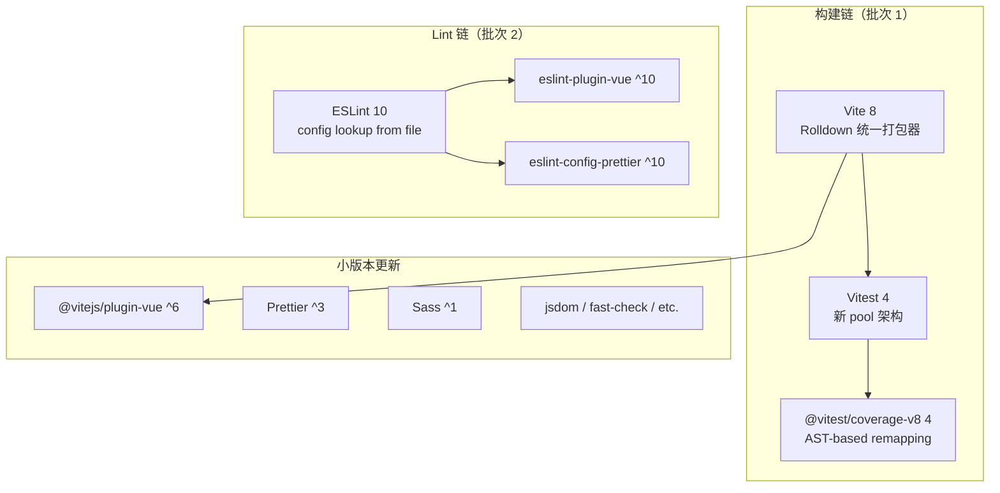

# Design Document

前端工具链大版本升级（v4.1）的技术设计，覆盖构建链（Vite 8 + Vitest 4）、Lint 链（ESLint 10）、其余小版本依赖更新三个批次的具体适配方案。

---

## Overview

本设计基于 `requirements.md` 的 7 条 Requirement 和 Clarification Round 的 3 项决策（Q1–Q3），将升级工作分解为可执行的技术方案。核心工作是查阅各工具的 migration guide，确定 breaking changes 对本项目的实际影响，并制定配置适配方案。

### 升级范围

| 工具 | 当前版本 | 目标版本 | Breaking 程度 |
|------|----------|----------|---------------|
| Vite | ^7 | ^8 | 高（Rolldown 替代 esbuild + Rollup） |
| Vitest | ^3 | ^4 | 中（pool 重写、coverage 变更） |
| @vitest/coverage-v8 | ^3.2.4 | ^4 | 中（跟随 Vitest） |
| ESLint | ^9 | ^10 | 低（本项目已用 flat config） |
| 其余 9 个包 | 各小版本 | 最新小版本 | 低 |

### 执行策略

分两批 + 收尾 + PHP 依赖：

```
批次 1: 构建链（Vite 8 + Vitest 4 + @vitest/coverage-v8）
  → 验证: npm run test / build / release
批次 2: Lint 链（ESLint 10）
  → 验证: npm run lint
收尾: 其余小版本 + lock 重生成 + state 文档更新
  → 验证: npm run test / build / lint + npm audit
PHP: composer 依赖小版本更新
  → 验证: composer update + phpunit
```

### 关键决策摘要

| 决策点 | 选择 | 来源 |
|--------|------|------|
| 条件 AC 不成立时 | 自动视为通过（WHEN 语义） | CR Q1 |
| npm audit 漏洞 | 最终状态零 critical/high，否则记录为已知风险 | CR Q2 |
| 小版本兼容性问题 | 仍升级到最新，兼容性问题作为 bug 修复 | CR Q3 |
| 配置适配深度 | 修复 breaking + 采用新推荐写法 | goal.md Q2 |
| lock 文件 | 删除后重新生成 | goal.md Q3 |
| 问题处理策略 | 任何时候发现的问题，不论是不是新引入的，都应该立即处理 | 用户决策 |

---

## Architecture

升级后系统架构不变，仅底层工具链更新：



### 构建流程变化

| 阶段 | Vite 7（当前） | Vite 8（目标） |
|------|---------------|---------------|
| 开发转换 | esbuild | Oxc |
| 生产打包 | Rollup | Rolldown |
| CSS 压缩 | esbuild | Lightning CSS |
| JS 压缩 | esbuild | Oxc Minifier |
| 依赖预优化 | esbuild | Rolldown |

本项目不使用 esbuild 自定义选项、Rollup 插件（除 @vitejs/plugin-vue）、或高级打包配置，因此 Rolldown 迁移对本项目影响极小。

---

## Components and Interfaces

### 批次 1: Vite 8 Breaking Changes 影响分析

基于 [Vite 8 Migration Guide](https://main.vitejs.dev/guide/migration) 的 breaking changes，逐项评估对本项目的影响：

#### 1.1 Rolldown 替代 esbuild + Rollup

| Breaking Change | 本项目影响 | 适配方案 |
|----------------|-----------|----------|
| 依赖预优化使用 Rolldown | 无直接影响（未使用 `optimizeDeps.esbuildOptions`） | 无需变更 |
| JS 转换使用 Oxc | 无直接影响（未使用 `esbuild` 顶层选项） | 无需变更 |
| JS 压缩使用 Oxc Minifier | 无直接影响（未自定义压缩选项） | 无需变更 |
| CSS 压缩使用 Lightning CSS | 无直接影响（未自定义 CSS 压缩） | 无需变更 |
| `build.rollupOptions` 重命名为 `build.rolldownOptions` | **有影响** — 当前使用 `build.rollupOptions.input` | 重命名为 `build.rolldownOptions.input` |

#### 1.2 CommonJS Interop 变更

本项目所有源码均为 ESM（`"type": "module"`），不直接导入 CJS 模块。第三方依赖的 CJS interop 由 Vite 内部处理，预计无影响。如遇问题按 CR Q3 决策作为 bug 修复。

#### 1.3 其他 Breaking Changes

| Breaking Change | 本项目影响 | 适配方案 |
|----------------|-----------|----------|
| 默认浏览器目标更新（Chrome 107→111 等） | 无影响（目标浏览器范围更窄是好事） | 无需变更 |
| `import.meta.url` 在 UMD/IIFE 中不再 polyfill | 无影响（本项目输出 ESM） | 无需变更 |
| `build.rollupOptions.watch.chokidar` 移除 | 无影响（未使用） | 无需变更 |
| `manualChunks` 对象形式移除 | 无影响（未使用） | 无需变更 |
| Module Type 自动检测 | 无影响（不编写自定义 load/transform 插件） | 无需变更 |
| `esbuild` 成为可选依赖 | 无影响（不直接使用 `transformWithEsbuild`） | 无需变更 |

#### 1.4 Vite 8 推荐写法

| 推荐变更 | 适配方案 |
|----------|----------|
| `build.rollupOptions` → `build.rolldownOptions` | 采用新名称 |
| `optimizeDeps.esbuildOptions` → `optimizeDeps.rolldownOptions` | 未使用，无需变更 |
| 顶层 `esbuild` 选项 → `oxc` 选项 | 未使用，无需变更 |

### 批次 1: Vitest 4 Breaking Changes 影响分析

基于 [Vitest 4 Migration Guide](https://main.vitest.dev/guide/migration) 的 breaking changes：

#### 2.1 Pool 架构重写

| Breaking Change | 本项目影响 | 适配方案 |
|----------------|-----------|----------|
| `poolOptions` 移除，选项提升为顶层 | 无影响（当前未使用 `poolOptions`） | 无需变更 |
| `maxThreads`/`maxForks` → `maxWorkers` | 无影响（未配置） | 无需变更 |
| `singleThread`/`singleFork` → `maxWorkers: 1, isolate: false` | 无影响（未配置） | 无需变更 |

#### 2.2 Coverage 变更

| Breaking Change | 本项目影响 | 适配方案 |
|----------------|-----------|----------|
| `coverage.all` 移除 | 无影响（当前未设置 `coverage.all`） | 无需变更 |
| `coverage.extensions` 移除 | 无影响（未设置） | 无需变更 |
| V8 coverage 使用 AST-based remapping | 覆盖率数值可能变化，但不影响功能 | 接受新数值 |
| `coverage.experimentalAstAwareRemapping` 移除 | 无影响（未设置） | 无需变更 |
| 推荐显式设置 `coverage.include` | **适配** — 采用新推荐写法 | 添加 `coverage.include` |

#### 2.3 其他 Vitest 4 Breaking Changes

| Breaking Change | 本项目影响 | 适配方案 |
|----------------|-----------|----------|
| 默认 exclude 简化（不再排除 dist/cypress 等） | 无影响（测试文件在 `tests/` 目录） | 无需变更 |
| `workspace` → `projects` | 无影响（未使用 workspace） | 无需变更 |
| Browser Provider 重写 | 无影响（未使用 Browser Mode） | 无需变更 |
| Reporter API 变更 | 无影响（未使用自定义 reporter） | 无需变更 |
| `vi.restoreAllMocks` 行为变更 | 需检查测试代码是否依赖旧行为 | 如有问题按 bug 修复 |
| `vi.fn().getMockName()` 返回值变更 | 无影响（测试中未断言 mock name） | 无需变更 |
| Vitest 4 要求 Vite >= 6.0.0 | 满足（升级到 Vite 8） | 无需变更 |
| Vitest 4 要求 Node.js >= 20.0.0 | 满足（项目要求 >= 24） | 无需变更 |

#### 2.4 Vitest 4 推荐写法

| 推荐变更 | 适配方案 |
|----------|----------|
| 显式设置 `coverage.include` | 添加 `coverage.include: ['src/**/*.{js,vue}', 'slimvue.js', 'scripts/**/*.js']` |

### 批次 2: ESLint 10 Breaking Changes 影响分析

基于 [ESLint v10.0.0 Release](https://eslint.org/blog/2026/02/eslint-v10.0.0-released/) 的 breaking changes：

#### 3.1 配置查找算法变更

| Breaking Change | 本项目影响 | 适配方案 |
|----------------|-----------|----------|
| 配置文件从被 lint 文件所在目录开始查找（而非 CWD） | 无影响（单一 `eslint.config.js` 在项目根目录） | 无需变更 |

#### 3.2 eslintrc 功能完全移除

| Breaking Change | 本项目影响 | 适配方案 |
|----------------|-----------|----------|
| `.eslintrc.*` 不再识别 | 无影响（已使用 flat config） | 无需变更 |
| `.eslintignore` 不再识别 | 无影响（使用 config 中的 `ignores`） | 无需变更 |
| `/* eslint-env */` 注释报错 | 需检查源码中是否有此注释 | 如有则移除 |

#### 3.3 JSX 引用追踪

| Breaking Change | 本项目影响 | 适配方案 |
|----------------|-----------|----------|
| JSX 引用现在被追踪 | 无影响（Vue SFC 不使用 JSX） | 无需变更 |

#### 3.4 已移除的废弃 API

| Breaking Change | 本项目影响 | 适配方案 |
|----------------|-----------|----------|
| `context.getCwd()` 等废弃方法移除 | 无影响（不编写自定义规则） | 无需变更 |
| 废弃 SourceCode 方法移除 | 无影响（不编写自定义规则） | 无需变更 |

#### 3.5 `eslint:recommended` 更新

| Breaking Change | 本项目影响 | 适配方案 |
|----------------|-----------|----------|
| 新增推荐规则 | 无影响（当前使用 `@eslint/js` 的 `configs.recommended`，非 `eslint:recommended` 字符串） | 无需变更，但 `@eslint/js` 内部的 recommended 也会更新 |

如果 `@eslint/js` 更新后新增规则导致 lint 报错，按 CR Q3 决策作为 bug 修复处理。

#### 3.6 Node.js 版本要求

| Breaking Change | 本项目影响 | 适配方案 |
|----------------|-----------|----------|
| 要求 Node.js ^20.19.0 \|\| ^22.13.0 \|\| >=24 | 满足（项目要求 >= 24） | 无需变更 |

#### 3.7 ESLint 10 推荐写法

| 推荐变更 | 适配方案 |
|----------|----------|
| 配置对象添加 `name` 字段 | 为每个配置块添加描述性 `name` |

### 配置文件适配方案

#### `vite.config.js` 变更

```javascript
// Before (Vite 7)
build: {
    rollupOptions: {
        input: inputMap,
    },
    outDir: process.env.OUTPUT_DIR || 'dist',
},

// After (Vite 8)
build: {
    rolldownOptions: {
        input: inputMap,
    },
    outDir: process.env.OUTPUT_DIR || 'dist',
},
```

同时为 Vitest 配置添加 `coverage.include`：

```javascript
// Before
test: {
    environment: 'jsdom',
    globals: true,
    coverage: {
        provider: 'v8',
        reporter: ['text', 'lcov', 'clover'],
    },
},

// After
test: {
    environment: 'jsdom',
    globals: true,
    coverage: {
        provider: 'v8',
        include: ['src/**/*.{js,vue}', 'slimvue.js', 'scripts/**/*.js'],
        reporter: ['text', 'lcov', 'clover'],
    },
},
```

#### `eslint.config.js` 变更

为配置块添加 `name` 字段（ESLint 10 推荐写法）：

```javascript
// Before
export default [
    {
        ignores: ['coverage/**', 'dist/**', 'node_modules/**'],
    },
    js.configs.recommended,
    ...pluginVue.configs['flat/recommended'],
    eslintConfigPrettier,
    {
        rules: { /* ... */ },
    },
    // ...
];

// After
export default [
    {
        name: 'slimvue/ignores',
        ignores: ['coverage/**', 'dist/**', 'node_modules/**'],
    },
    js.configs.recommended,
    ...pluginVue.configs['flat/recommended'],
    eslintConfigPrettier,
    {
        name: 'slimvue/base-rules',
        rules: { /* ... */ },
    },
    {
        name: 'slimvue/node-scripts',
        files: ['scripts/**/*.js', 'vite.config.js', 'postcss.config.cjs'],
        languageOptions: { /* ... */ },
        rules: { /* ... */ },
    },
    {
        name: 'slimvue/browser-source',
        files: ['src/**/*.js', 'src/**/*.vue', 'slimvue.js'],
        languageOptions: { /* ... */ },
    },
    {
        name: 'slimvue/test-files',
        files: ['tests/**/*.js'],
        languageOptions: { /* ... */ },
        rules: { /* ... */ },
    },
];
```

### `package.json` 版本变更

```json
{
    "devDependencies": {
        "@vitejs/plugin-vue": "^6",
        "@vitest/coverage-v8": "^4",
        "@vue/test-utils": "^2.4",
        "autoprefixer": "^10.5.0",
        "eslint": "^10",
        "eslint-config-prettier": "^10",
        "eslint-plugin-vue": "^10",
        "fast-check": "^4",
        "jsdom": "^29.1.1",
        "prettier": "^3.6",
        "sass": "^1.92",
        "vite": "^8",
        "vitest": "^4"
    }
}
```

注意：小版本依赖的具体版本号在 `npm install` 时由 npm 解析到最新兼容版本，`package.json` 中的 range 声明保持宽松（如 `^6`、`^10`），实际安装版本由 lock 文件锁定。

### PHP 依赖更新（Composer）

独立于前端工具链升级，顺带将 `composer.json` 中的 PHP 依赖更新到当前大版本线内的最新小版本。

#### 当前依赖

| 包 | 当前约束 | 操作 |
|----|----------|------|
| `oasis/http` | ^3.1 | 更新到最新 ^3 小版本 |
| `oasis/utils` | ^3.0 | 更新到最新 ^3 小版本 |
| `symfony/console` | ^8.0 | 更新到最新 ^8 小版本 |
| `symfony/filesystem` | ^8.0 | 更新到最新 ^8 小版本 |
| `phpstan/phpstan` | ^2.0 | 更新到最新 ^2 小版本 |
| `phpunit/phpunit` | ^13.0 | 更新到最新 ^13 小版本 |
| `twig/twig` | ^3.0 | 更新到最新 ^3 小版本 |
| `giorgiosironi/eris` | ~1.1 | 更新到最新 ~1.1 小版本 |

#### 执行方案

1. 运行 `composer update` 更新所有依赖到约束范围内的最新版本
2. 运行 `vendor/bin/phpunit` 确认所有 PHP 测试通过
3. 运行 `vendor/bin/phpstan analyse` 确认静态分析通过（如有问题立即修复）
4. 提交更新后的 `composer.lock`

---

## Data Models

本次升级不涉及数据模型变更。所有变更限于：

1. **配置文件**：`vite.config.js`、`eslint.config.js`、`package.json` 的声明性内容
2. **文档**：`docs/state/architecture.md` 的版本号和工具描述
3. **Lock 文件**：`package-lock.json` 完全重新生成

无持久化数据、API 接口、或运行时数据结构的变更。

---

## Error Handling

### 核心原则

**任何时候发现的问题，不论是不是新引入的，都应该立即处理。** 这意味着升级过程中遇到的所有错误、警告、不规范写法，无论其根因是本次升级引入还是既有遗留，均在当前批次中修复，不推迟、不忽略。

### 升级过程中的错误场景

| 场景 | 处理方式 |
|------|----------|
| `npm install` 依赖解析失败 | 检查版本冲突，调整 range 或等待上游修复 |
| `npm run test` 失败 | 分析失败原因，无论是新引入还是既有问题，立即修复 |
| `npm run build` 失败 | 分析失败原因，按 Vite 8 migration guide 适配 |
| `npm run lint` 新增错误 | 分析规则变更，修复代码或调整规则配置；既有代码触发的新规则报错同样修复 |
| `npm audit` 发现 critical/high 漏洞 | 无论新旧，尝试升级相关依赖；如无修复版本，记录为已知风险（CR Q2） |
| 小版本兼容性问题 | 仍升级到最新，将问题作为 bug 修复（CR Q3） |
| 既有配置不规范写法 | 在本次升级中一并修正 |

### 回退策略

- 每批次验证通过后再进入下一批次
- 如某批次无法通过验证，可通过 git 回退到上一批次的状态
- lock 文件删除前无需备份（git 中有历史）

---

## Testing Strategy

### 测试方法

本次升级是基础设施/配置变更，不涉及业务逻辑或纯函数，**不适用 property-based testing**。原因：

- 所有变更都是声明性配置（版本号、配置选项）
- 验证方式是集成测试（运行 build/test/lint 命令检查退出码）
- 没有可以用不同输入反复测试的函数
- 运行 100 次 `npm run build` 不会比运行 1 次发现更多 bug

### 验证矩阵

| 验证项 | 命令 | 通过标准 | 覆盖 Requirement |
|--------|------|----------|-----------------|
| 测试通过 | `npm run test` | exit code 0，零失败 | 1.4, 2.5, 5.10 |
| 开发构建 | `npm run build` | exit code 0，`dist/` 有产出 | 1.5, 2.6, 5.11 |
| 生产构建 | `npm run release` | exit code 0，`dist/` 有产出 | 1.6 |
| Lint 通过 | `npm run lint` | exit code 0，零新增错误 | 3.2, 3.3, 4.3, 4.4, 5.12 |
| 安全审计 | `npm audit` | 零 critical/high | 6.3 |
| 版本声明 | 读取 `package.json` | 各包版本符合目标 | 1.1–1.3, 3.1, 5.1–5.9 |
| 文档更新 | 读取 `architecture.md` | 版本号和描述已更新 | 7.1–7.5 |

### 执行顺序

1. **批次 1 验证**：`npm run test` + `npm run build` + `npm run release`
2. **批次 2 验证**：`npm run lint`
3. **收尾验证**：全量（test + build + release + lint + audit）

### 现有测试套件

项目已有以下测试文件，升级后应全部通过：

- `tests/build-check-node.test.js` — Node.js 版本检查
- `tests/build-config.test.js` — Vite 配置结构验证
- `tests/build-entries.test.js` — 入口扫描器
- `tests/build-tdk.test.js` — TDK 插件
- `tests/components.test.js` — Vue 组件
- `tests/migration-transform.test.js` — 迁移转换
- `tests/slimvue.test.js` — slimvue.js 核心模块

`tests/build-config.test.js` 中有对 `rollupOptions` 的字符串断言，升级后需要更新为 `rolldownOptions`（如果测试中有此断言）。

---

## State 文档更新方案

### `docs/state/architecture.md` 变更

技术选型表更新：

| 行 | 当前 | 目标 |
|----|------|------|
| 构建工具 | Vite \| ^7 | Vite（Rolldown） \| ^8 |
| 代码规范 | ESLint（flat config）+ Prettier \| ^9 / ^3.6 | ESLint（flat config）+ Prettier \| ^10 / ^3 |
| 前端测试 | Vitest \| ^3 | Vitest \| ^4 |

如果文档中有提及 esbuild 或 Rollup 作为 Vite 的打包器，需更新为 Rolldown。当前 `architecture.md` 的"构建工具"行仅写 `Vite | ^7`，无 esbuild/Rollup 的具体描述，因此 Req 7 AC4/AC5 的条件可能不成立（按 CR Q1 决策自动视为通过）。

---

## Impact Analysis

### 受影响的 State 文档

| 文件 | Section | 变更内容 |
|------|---------|----------|
| `docs/state/architecture.md` | 技术选型表 | Vite ^7→^8、Vitest ^3→^4、ESLint ^9→^10、Prettier ^3.6→^3 |
| `docs/state/architecture.md` | 构建工具描述（如有 esbuild/Rollup 提及） | 更新为 Rolldown |

### 现有模块行为变化

- **构建产物**：Rolldown 替代 esbuild + Rollup 后，产物的 chunk 拆分策略和压缩结果可能有细微差异（文件大小、hash），但功能等价
- **测试覆盖率数值**：Vitest 4 的 AST-based remapping 可能导致覆盖率数值与 Vitest 3 有差异，但不影响功能正确性
- **Lint 规则**：`@eslint/js` 更新后 recommended 规则集可能新增规则，可能产生新的 lint 报错

### 数据模型变更

不涉及。本次升级不改变任何持久化数据、API 接口或运行时数据结构。

### 外部系统交互

不涉及。本次升级不改变与外部系统的交互方式。

### 配置项变更

| 配置文件 | 变更类型 | 具体变更 |
|----------|----------|----------|
| `vite.config.js` | 重命名 | `build.rollupOptions` → `build.rolldownOptions` |
| `vite.config.js` | 新增 | `test.coverage.include` 显式声明 |
| `eslint.config.js` | 新增 | 各配置块添加 `name` 字段 |
| `package.json` | 版本变更 | 13 个依赖版本更新 |
| `package-lock.json` | 重新生成 | 删除后全新生成 |

### 问题处理策略

**决策**：任何时候发现的问题，不论是不是新引入的，都应该立即处理。

此决策影响以下场景的处理方式：
- `npm audit` 发现的漏洞：无论是否为本次升级引入，均需处理（与 CR Q2 一致）
- `npm run lint` 报错：无论是新规则触发还是既有代码问题，均需修复
- `npm run test` 失败：无论是 Vitest 4 行为变更导致还是既有测试缺陷，均需修复
- 配置文件中发现的不规范写法：即使不影响功能，也应在本次升级中一并修正

---

## Socratic Review

### Q1: design 是否完整覆盖了 requirements 中的每条需求？

是。7 条 Requirement 均有对应的技术方案：
- Req 1/2 → 批次 1 的 Vite 8 + Vitest 4 breaking changes 分析和配置适配方案
- Req 3/4 → 批次 2 的 ESLint 10 breaking changes 分析和配置适配方案
- Req 5 → package.json 版本变更 + 收尾批次
- Req 6 → 执行策略中的 lock 重生成步骤
- Req 7 → State 文档更新方案 section

### Q2: 技术选型是否合理？是否有更简单的替代方案？

本次升级是版本跟进，不涉及技术选型比选。唯一的"选型"是适配策略（最小适配 vs 采用新推荐写法），已在 goal.md Q2 中决策为后者。这是合理的——既然要升级，顺便采用新推荐写法可以减少后续维护成本。

### Q3: 配置变更方案是否足够具体，能让 task 独立执行？

是。`vite.config.js` 和 `eslint.config.js` 的变更都给出了 before/after 代码示例，task 执行者可以直接对照修改。`package.json` 的版本变更也列出了完整的目标版本表。

### Q4: 是否有过度设计？

无。所有变更都是 requirements 明确要求的，没有额外的抽象或预留扩展点。

### Q5: Impact Analysis 是否充分？

是。覆盖了 state 文档、模块行为变化、数据模型（不涉及）、外部系统（不涉及）、配置项变更五个维度。

### Q6: 是否存在未经确认的重大技术选型？

无。所有决策点（执行顺序、配置适配深度、lock 处理、问题处理策略）均已在 goal.md CR 或用户决策中确认。

---

## References

- [Vite 8 Migration Guide](https://main.vitejs.dev/guide/migration) — `build.rollupOptions` → `build.rolldownOptions`、Rolldown/Oxc 替代 esbuild/Rollup
- [Vitest 4 Migration Guide](https://main.vitest.dev/guide/migration) — pool 重写、coverage.all 移除、推荐显式 coverage.include
- [ESLint v10.0.0 Release](https://eslint.org/blog/2026/02/eslint-v10.0.0-released/) — eslintrc 完全移除、配置查找算法变更、JSX 追踪、推荐 name 字段
- [Vite 8 公告](https://main.vitejs.dev/blog/announcing-vite8) — Rolldown 统一打包器
- [Vitest 4 公告](https://main.vitest.dev/blog/vitest-4) — Browser Mode stable、Visual Regression


---

## Gatekeep Log

**校验时间**: 2025-07-15
**校验结果**: ⚠️ 已修正后通过

### 修正项

- [结构] 补充 `## Impact Analysis` section（覆盖 state 文档、模块行为变化、数据模型、外部系统、配置项变更五个维度）
- [结构] 补充 `## Socratic Review` section（覆盖 requirements 覆盖度、技术选型、方案具体性、过度设计、Impact 充分性、未确认选型六个维度）
- [内容] 在关键决策摘要表中补充用户新决策："任何时候发现的问题，不论是不是新引入的，都应该立即处理"
- [内容] 在 Error Handling section 补充核心原则段落，明确问题处理策略对各错误场景的影响
- [内容] 在 Impact Analysis 中新增"问题处理策略"小节，说明此决策对 audit/lint/test/配置场景的具体影响
- [内容] Error Handling 错误场景表补充"既有配置不规范写法"场景

### 合规检查

- [x] 无 TBD / TODO / 待定 / 占位符
- [x] 无空 section 或不完整的列表
- [x] 内部引用一致（requirements 编号、术语引用）
- [x] 代码块语法正确
- [x] 无 markdown 格式错误
- [x] 一级标题存在且正确
- [x] 技术方案主体存在，承接 requirements
- [x] 配置文件变更方案给出 before/after 代码
- [x] 各 section 之间使用 `---` 分隔
- [x] Impact Analysis 存在且覆盖五个维度
- [x] Socratic Review 存在且覆盖充分
- [x] 每条 Requirement 在 design 中有对应技术方案
- [x] Requirements CR（Q1–Q3）决策在 design 中体现
- [x] 用户新决策（问题立即处理）已写入
- [x] 技术选型有明确理由
- [x] 无过度设计
- [x] 与 state 文档描述的现有架构一致
- [x] 可 task 化（方案足够具体）

### Clarification Round

**状态**: 已回答

**Q1:** 批次 1（构建链）和批次 2（Lint 链）的 task 拆分粒度如何确定？

- A) 每个批次作为一个 task（粗粒度）：批次 1 = 1 task（升级 + 配置适配 + 验证），批次 2 = 1 task
- B) 按 requirement 拆分：每条 requirement 对应一个 task（共 7 个 task）
- C) 按操作类型拆分：版本升级 1 task + 配置适配 1 task + 验证 1 task（每批次 3 个 task）
- D) 其他（请说明）

**A:** A — 每个批次作为一个 task（粗粒度）

**Q2:** `tests/build-config.test.js` 中可能存在对 `rollupOptions` 的断言需要更新为 `rolldownOptions`。这类测试代码的适配应该：

- A) 作为批次 1 配置适配 task 的一部分（与 vite.config.js 变更同一个 task）
- B) 作为独立的"测试代码适配" task
- C) 不单独列为 task，在验证阶段发现失败时顺带修复
- D) 其他（请说明）

**A:** B — 作为独立的"测试代码适配" task

**Q3:** 收尾阶段的 state 文档更新（Req 7）和 lock 文件重生成（Req 6）的执行时机：

- A) 所有依赖升级和配置适配完成后，作为最后一个 task 统一处理
- B) lock 文件在批次 1 开始前就删除重生成（因为 goal.md 决策是"删除后重新生成"），state 文档在最后更新
- C) 每个批次结束后都重新生成 lock（确保每批次的 lock 是干净的），state 文档在最后更新
- D) 其他（请说明）

**A:** B — lock 文件在批次 1 开始前就删除重生成，state 文档在最后更新

**Q4:** "任何时候发现的问题都应立即处理"这一决策在 task 执行中的边界：如果某个既有问题的修复工作量较大（如需要重构测试代码），是否仍在当前 task 中处理？

- A) 是，无论工作量大小，发现即处理，不拆分
- B) 小修复立即处理；大修复（预计超过当前 task 工作量的 50%）创建独立 task 但仍在本次 release 中完成
- C) 小修复立即处理；大修复记录为 issue，不阻塞当前 release
- D) 其他（请说明）

**A:** B — 小修复立即处理；大修复创建独立 task 但仍在本次 release 中完成

**Q5（用户追加）:** 用户要求在 tasks 中增加一个独立 task：更新 `composer.json` 中的 PHP 依赖到当前大版本线内的最新小版本，并运行 `composer update` + PHPUnit 验证。

**A:** 已确认，将作为独立 task 编排
